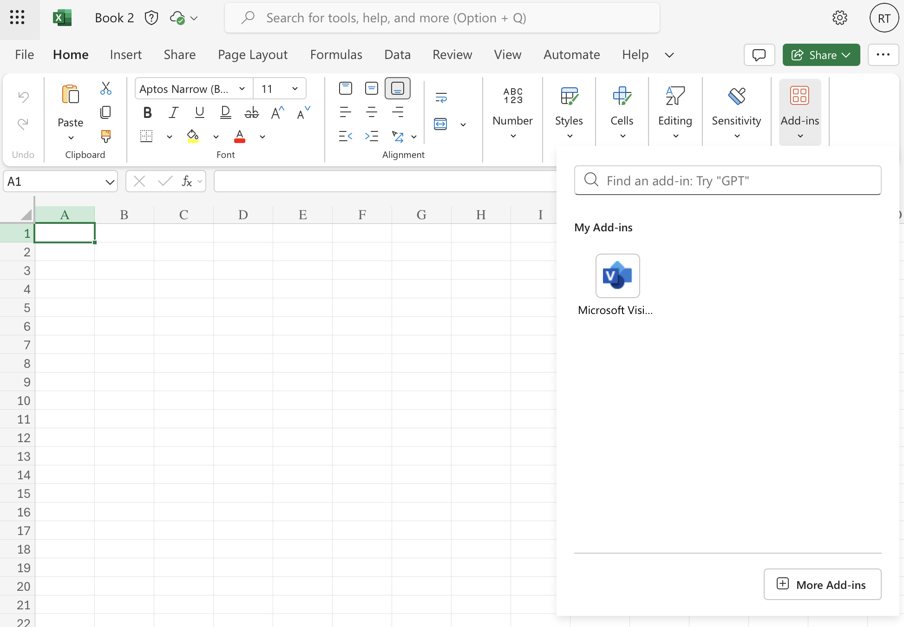
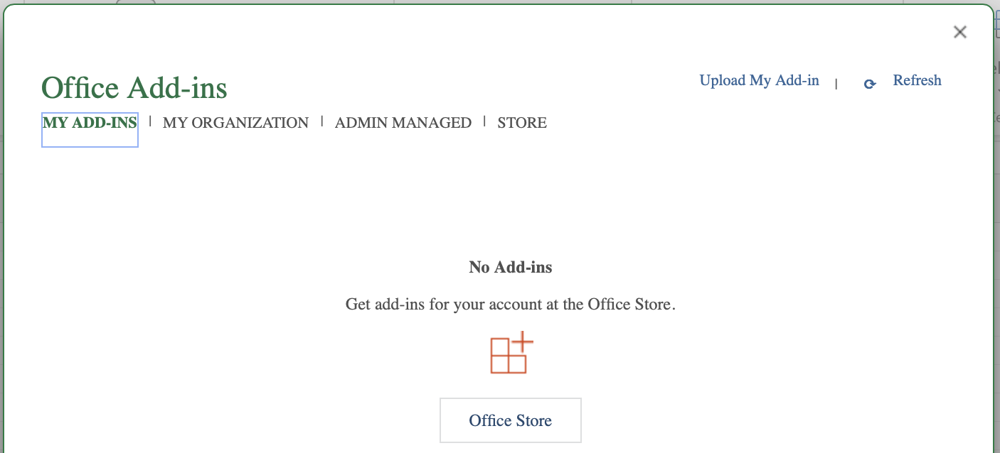
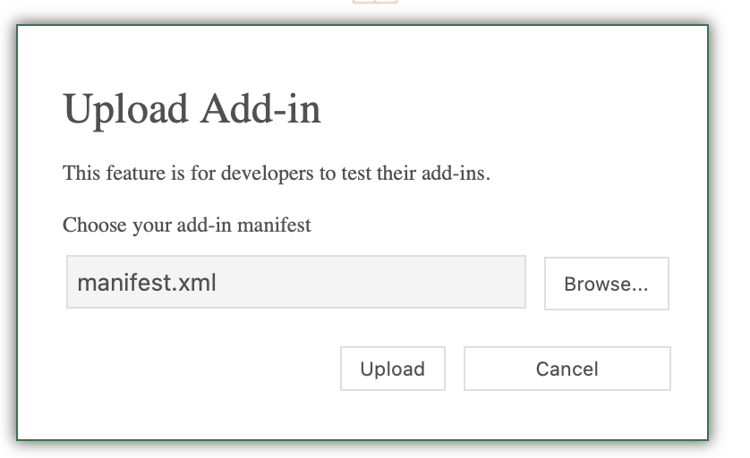
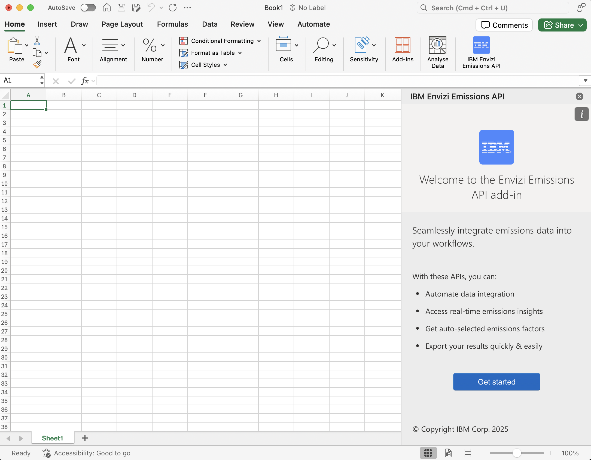
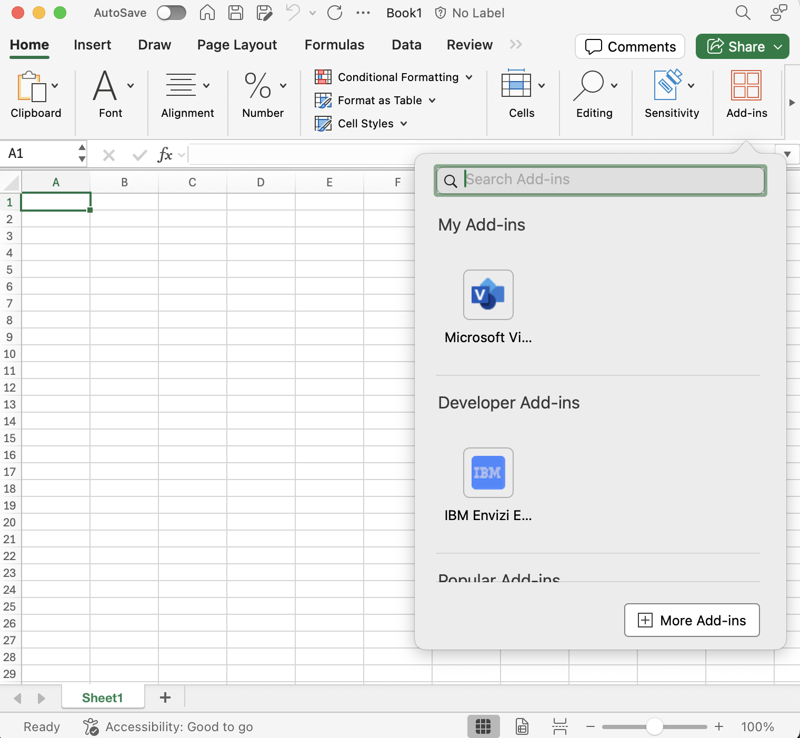
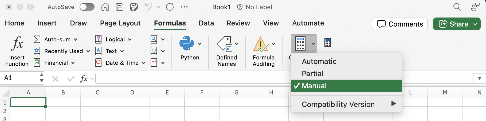

============
Installation
============

-------------
Prerequisites
-------------

Before installing the add-in, ensure the following requirements are met:

- Microsoft Excel (Office 365 Online, Mac or Windows)
- Active internet connection
- API credentials (``apiKey``, ``tenantId``, ``orgId``), are available on the `Overview Dashboard <https://www.app.ibm.com/envizi/emissions-api-home/overview?cuiURL=%2Femissions-api-home%2Foverview>`_ after `sign up <https://www.ibm.com/account/reg/us-en/signup?formid=urx-53999>`_.

-------
Install 
-------

In order to use **IBM Envizi Emissions API** for Excel, there are two options to install:

1. Download from the AppSource Store (coming soon)
2. Sideload a manifest.xml file

Microsoft AppSource Store
=========================

Coming soon.

Sideload
========

Download the Manifest File
--------------------------

The manifest file is available at the following location:

`manifest.xml <https://plugins.app.ibm.com/excel-addin/manifest.xml>`_

.. important::
 If your browser displays the XML content instead of downloading the file, select **File** → **Save As**, name the file **manifest.xml**, and save it to your preferred location.

The following sections contain instructions for sideloading the Add-in in different environments, please choose the one that is relevant:

1. Office 365 - Online
2. Mac
3. Windows

Office 365 - Online
-------------------

Office 365 Online provides the most straightforward method for sideloading the add-in.

- Go to `Excel <https://excel.cloud.microsoft/>`_
- From the **Home** tab, click Add-ins
- Click **More Add-ins**

- Click **Upload My Add-in**

- Click **Browse**
- Find the **manifest.xml** you downloaded
- Click **Upload**

- Confirm the installation. A new **IBM Envizi Emissions API Add-in** button will appear in the Excel ribbon (typically under the **Home** tab).

Windows
-------

The installation on a local Windows machine requires a network share and additional configuration steps.

Please follow the :doc:`Windows <windows>` documentation.

Mac
---

- Open `Finder`
- On the top menu bar, click `Go`
- From the drop down menu that appears, click `Go to folder`

.. code-block:: none

   /Users/<username>/Library/Containers/com.microsoft.Excel/Data/Documents
   
.. note::

   - <username> should be replaced with the name of your Mac user

- If the `wef` folder does not exist, right-click and create a folder called `wef`
- Click on the `wef` folder to enter it
- Place your downloaded `manifest.xml` file in the `wef` folder

.. image:: _images/placing-wef-file.png
   :alt: Placing manifest file in Mac directory
   :align: center
   
After successfully placing the manifest file, the add-in will appear in the Developer Add-in section.

For more information please see the `Microsoft 365 Office Add-in Mac <https://learn.microsoft.com/en-us/office/dev/add-ins/testing/sideload-an-office-add-in-on-mac>`_ documentation for Mac.

--------------------
Calculation Mode Tip
--------------------

After installation, change the calculation mode to **Manual** to prevent unnecessary API calls:

1. Go to **Formulas → Calculation Options**.
2. Select **Manual**.

3. To recalculate a formula in manual calculation mode either press **F9** or do the following:
   
   - Select the cell
   - Press F2 (this puts the cell into edit mode)
   - Press Enter