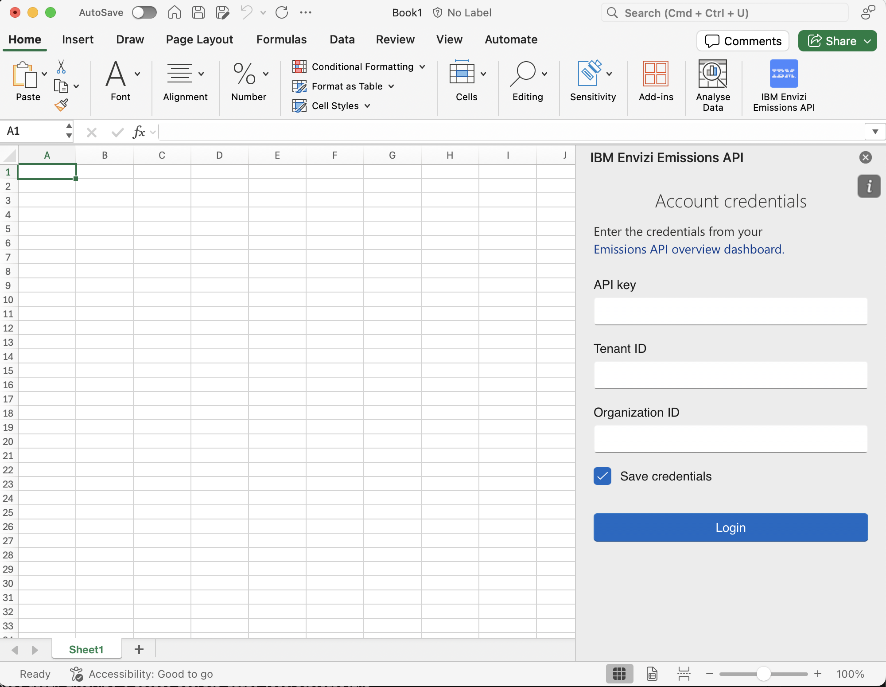
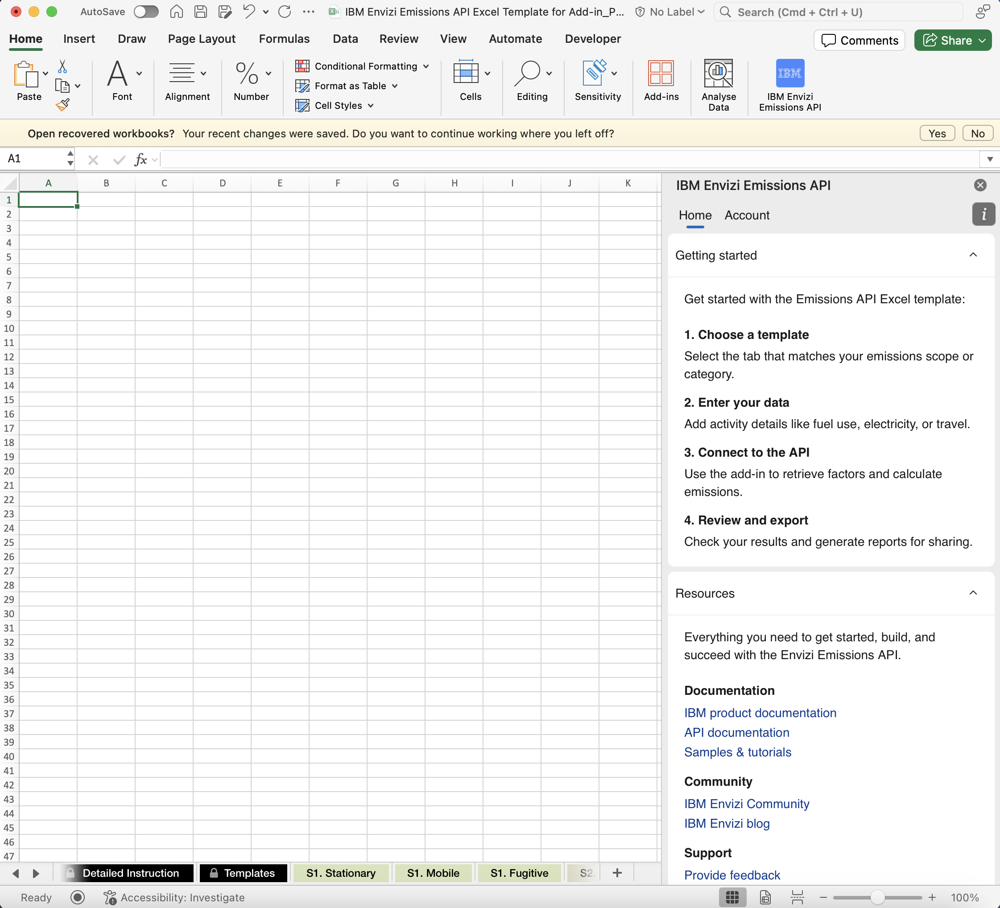
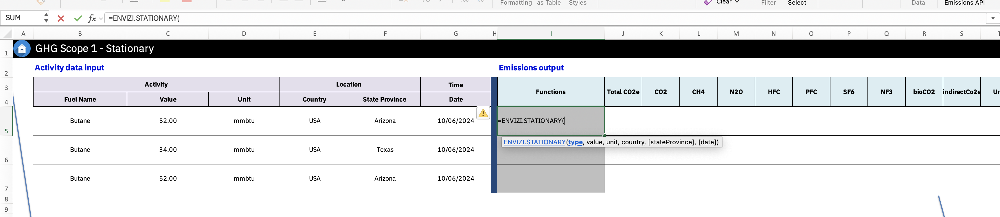
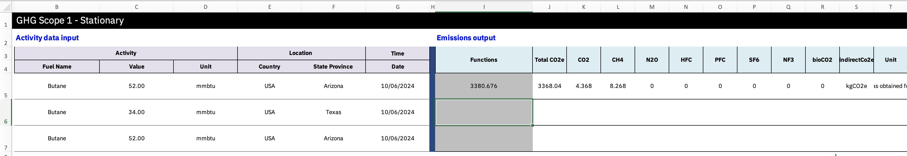
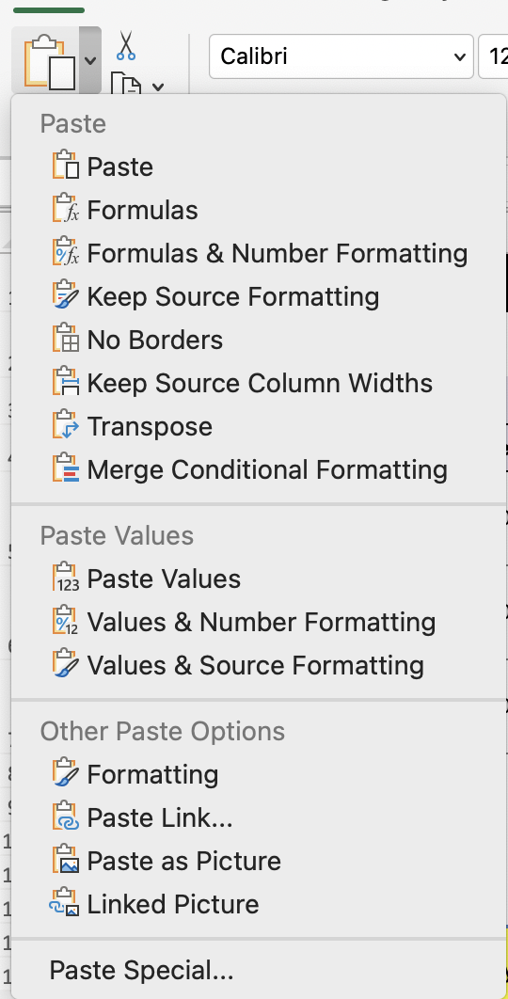

===
Use
===

Logging In
----------

After installation, launch the add-in by clicking the **Envizi Add-in** button on the Excel ribbon.

When prompted, provide your credentials:

- **apiKey** – API access key
- **tenantId** – Tenant identifier
- **orgId** – Organization identifier

Credentials are validated against the Envizi API.
Once validated, the **main interface** of the add-in becomes available:

Working with Functions
----------------------

The add-in provides custom Excel functions that retrieve and calculate emissions data.

**Example: Stationary emissions**

Users can enter a function such as:

.. code-block:: none

   =ENVIZI.STATIONARY(type, value, unit, country, [stateProvince], [date])

**Parameters**

- ``type``: Activity type
- ``value``: Numeric activity value
- ``unit``: Unit of measurement
- ``country``: ISO alpha-3 country code
- ``stateProvince`` *(optional)*: State or province identifier
- ``date`` *(optional)*: Activity date

.. note::
   Ensure that there are enough empty cells available to display the results. If sufficient space is not available, a spill error will occur.

**Process**

1. The add-in processes the inputs and formats them for the Envizi API.
2. The Envizi API calculates the emissions data.
3. The result is returned and displayed in the Excel cell.

.. note::
   If an error occurs, the add-in will display an error message once you hover over warning icon.

   .. image:: _images/error.png
      :alt: Example error message
      :align: center
      :width: 220
      :height: 145

Exporting Results
-----------------

To export computed results (without formulas):

1. Copy the cells containing the formulas.
2. Use **Paste Values** to paste only the calculated results into a new location.

